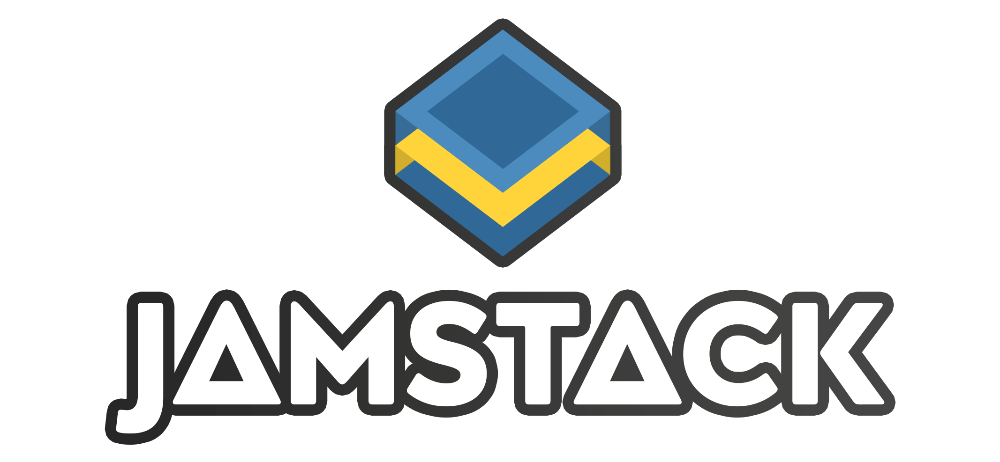

<div align="center">
  
</div>


## Installation

```bash
python -m pip install jamstack
```

## Create basic project

```bash
jamstack plain <foldername>
```

`jamstack plain myproject`

## Templates

Jamstack has templates available courtesy of [html5up](https://html5up.net).

| Template                                   | Command   | Tutorial                                                     |
| ------------------------------------------ | --------- | ------------------------------------------------------------ |
| [Massively](https://html5up.net/massively) | massively |                                                              |
| [Phantom](https://html5up.net/phantom)     | phantom   | [**HERE**](https://github.com/Abdur-rahmaanJ/jamstack/wiki/Phantom-template) |

The syntax is as follows:

```bash
jamstack t <template> <foldername>
```

Use the `--existing` flag if you want the project to be created in an existing folder

```bash
jamstack t massively myproject --existing
```

## Build

To build the site run the file `static.py`.

```bash
python static.py
```

Your site will be generated in the **dist/** folder.

Alternatively you can use the `--server` flag if you want to start livewatch.

## Sites using jamstack

- [DeliciousPy Telegram Channel](https://deliciouspy.github.io/)
- [The Flask Community Work Group](https://flaskcwg.github.io/)
- [A Personal Site](https://compileralchemy.github.io/)
